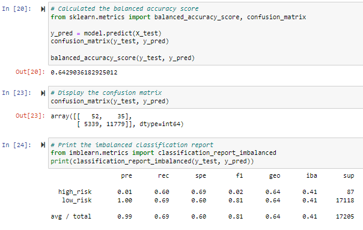

# Credit_Risk_Analysis
## Overview
The purpose of this analysis is to create a supervised machine learning model that will help make decisions on loan applications based on data entered. Six different models will be created and compared to find out which one has the best perfomance.
## Results
Balanced oversampling results.  
  
- Accuracy= 64.29%
- High risk precision= 1%
- Low risk precision= 100%
- High risk recall= 60%
- Low risk recall=69%

Undersampling results.  
  
- Accuracy= 64.62%
- High risk precision= 1%
- Low risk precision= 100%
- High risk recall= 61%
- Low risk recall=45%

SMOTE results.  
  
- Accuracy= 64.62%
- High risk precision= 1%
- Low risk precision= 100%
- High risk recall= 61%
- Low risk recall=45%

SMOTEEN results.  
  
- Accuracy= 52.93%
- High risk precision= 1%
- Low risk precision= 100%
- High risk recall= 70%
- Low risk recall=57%

Random forest sampling results.  
  
- Accuracy= 99.6%
- High risk precision= 73%
- Low risk precision= 100%
- High risk recall= 34%
- Low risk recall=100%

Easy ensemble sampling results.  
  
- Accuracy= 94.26%
- High risk precision= 7%
- Low risk precision= 100%
- High risk recall= 91%
- Low risk recall=94%
## Summary
Base off of these results, I would not recomend any of these learning models, as they all seem to be "aggresive", eventhough not approving high risk customers is desirable, these models would decline a lot of applicants, inluding those who would be concider low risk.